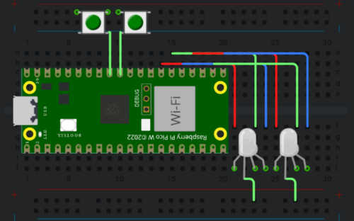

# USB Rubber Ducky written in CircuitPython for Raspberry Pi Pico W
## My hardware:
You technically don't need any hardware aside from the Pico W to run this. My hardware setup is viewable at https://wokwi.com/projects/428096216043299841, or in the diagram below:

## Usage:
- Install CircuitPython from https://circuitpython.org/board/raspberry_pi_pico_w/
- Make the root of your `CIRCUITPY` drive represent this repo. The easiest way to do this is to run `git clone https://github.com/TheTridentGuy/pico-w-badusb.git` from a folder you're ok with cloning a repo into (i.e, your home directory), and then running `cp -r pico-w-badusb/. /run/media/<user>/CIRCUITPY` to copy it over. Note the usage of `pico-w-badusb/.`, adding the `.` to ensure that every file, including hidden files, is copied.
- Your Pi Pico should now be set up. Note that on future boots, the `CIRCUITPY` drive won't show up. To re-enable USB mass storage mode, plug it in while shorting `GP26` or `GP27` to `3.3v`. If this fails, you may attempt to use the REPL to delete `boot.py`, which handles this behavior.

## License:
> The CircuitPython libraries in `/lib` are provided under their own license.

    pico-w-badusb - CircuitPython+Rapsberry Pi Pico W badusb.
    Copyright (C) 2025 Aiden Bohlander

    This program is free software: you can redistribute it and/or modify
    it under the terms of the GNU General Public License as published by
    the Free Software Foundation, either version 3 of the License, or
    (at your option) any later version.

    This program is distributed in the hope that it will be useful,
    but WITHOUT ANY WARRANTY; without even the implied warranty of
    MERCHANTABILITY or FITNESS FOR A PARTICULAR PURPOSE.  See the
    GNU General Public License for more details.

    You should have received a copy of the GNU General Public License
    along with this program.  If not, see <https://www.gnu.org/licenses/>.